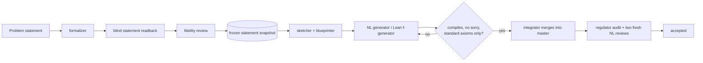

# frontier-math-agents

AI agent teams for solving frontier math problems.

This repository uses [ClawCodex](https://github.com/agentforce314/clawcodex) as
the agent harness to build a team of 26 specialist AI agents that work on
research-level mathematics together. The team produces natural-language
proofs, formalizes them in Lean 4, and checks each other's work. It also holds
the complete record of the team's runs: prompts, plans, failed attempts,
reviews, Lean sources, build logs and hashes. Anyone can audit a result, not
only read its conclusion.

The team's design rests on three rules:

- **Specialists own the mathematics.** A `team-lead` session routes work and
  keeps records, but never fills a mathematical gap itself.
- **Every claim is checked by someone who didn't write it.** Reviewers start
  from a clean context with only the exact artifact to check. Lean statements
  get a *blind* readback from an agent that is never told the intended theorem.
- **Evidence lives in files, not in chat.** Every accepted artifact is pinned
  by SHA-256. Every Lean result is tied to the commands, exit codes and axiom
  lists that establish it.

## Results

| Problem | Result | How it was checked |
|---|---|---|
| **Liouville–Goldbach, multiples of four:** every positive multiple of 4 is `a + b` with `λ(a) = λ(b) = −1` | **Proved** | Lean 4 theorem [`ArithmeticStatement.representation_multiple_four`](.clawcodex/math-team/problems/liouville-goldbach-jul2026/lean/Statement/FourWork/Assembly.lean), using only the standard axioms `propext`, `Classical.choice`, `Quot.sound`; two independent mathematics reviews and a final regulator audit |
| **Liouville–Goldbach, full conjecture:** every even `N > 2` | **Not resolved** by this project; partial results only | 42 Lean-checked partial theorems (see [below](#partial-results-for-the-full-conjecture)) |
| **Infinitely many primes** (smoke test of the natural-language workflow) | Proved in natural language | Independent LLM review only; **not** Lean-checked |

## The problem in focus: a Goldbach-type problem for the Liouville function

Let `Ω(n)` count the prime factors of `n` with multiplicity (`Ω(1) = 0`), and
let `λ(n) = (−1)^Ω(n)` be the Liouville function. The conjecture the team was
given is:

> For every even integer `N > 2` there exist positive integers `a, b` (with
> `a = b` allowed) such that `N = a + b` and `λ(a) = λ(b) = −1`.

It is a Goldbach-type statement where "prime" is weakened to "has an odd number
of prime factors". A. P. Mangerel (arXiv:2404.12117v2, Remark 2) poses this
exact question. His paper proves a related correlation result only for
sufficiently large `N`, with no effective threshold.

The run was held to a **source cutoff of 2026-07-31**. Agents could use only
literature, library code and toolchains that were publicly available on or
before that date. Lean, Mathlib and every dependency are pinned to commits
whose public CI records predate the cutoff. The source ledger is
[`sources.md`](.clawcodex/math-team/problems/liouville-goldbach-jul2026/sources.md).

The full prompt given to the team is
[`prompts/liouville-goldbach-math-team-lean.md`](prompts/liouville-goldbach-math-team-lean.md).
Use it to reproduce the problem-solving process; see
[Reproducing the problem-solving run](#reproducing-the-problem-solving-run).

### The multiples-of-four theorem

```lean
theorem ArithmeticStatement.representation_multiple_four (m : ℕ) (hm : 0 < m) :
    ArithmeticStatement.HasRepresentation (4 * m)
```

Unfolded, the conclusion is exactly:

```lean
∃ a b : ℕ, 0 < a ∧ 0 < b ∧ 4 * m = a + b ∧
  (-1 : ℤ) ^ a.primeFactorsList.length = -1 ∧
  (-1 : ℤ) ^ b.primeFactorsList.length = -1
```

There are no side conditions on `m` or the witnesses. `m = 1` is included, and
equal summands are allowed.

The proof is in
[`PROOF.md`](.clawcodex/math-team/problems/liouville-goldbach-jul2026/waves/multiples-four/PROOF.md),
with [HTML](.clawcodex/math-team/problems/liouville-goldbach-jul2026/waves/multiples-four/PROOF.html)
and [PDF](.clawcodex/math-team/problems/liouville-goldbach-jul2026/waves/multiples-four/PROOF.pdf)
editions. Its outline:

1. **Reduce to `4p` for odd primes `p`.** If `λ(m) = 1`, use `2m + 2m`. If `m`
   is even, scale `8 = 3 + 5` or `4 + 4`. Otherwise, scale a representation of
   `4p` by a cofactor `d` with `λ(d) = 1`.
2. **Assume `4p` has no representation.** Then scaling identities force strong
   sign constraints on `λ` below `p`.
3. **Ternary gap descent.** This yields *full antireflection*:
   `λ(p − n) = −λ(n)` for `0 < n < p`.
4. **Antireflection makes `λ` multiplicative on `(ℤ/pℤ)^×`,** so `λ` is
   positive on every nonzero square mod `p`.
5. **Contradiction.**
   - For `p ≡ 1 (mod 4)`: `−1` is a square mod `p`, but `λ(p − 1) = −1`.
   - For `p ≡ 3 (mod 4)`, `p ≥ 7`: a prime `r` dividing `(p + 1)/4` is a
     square mod `p`, but `λ(r) = −1`.
   - For `p = 3`: `12 = 5 + 7`.

**Novelty and attribution.** A post-hoc audit is recorded in
[`NOVELTY_VERDICT.md`](.clawcodex/math-team/problems/liouville-goldbach-jul2026/waves/multiples-four/NOVELTY_VERDICT.md).
Its findings:

- **The theorem itself is not new.** A proof of the full all-even conjecture
  appeared publicly on 2026-09-16, after the cutoff, and implies it.
- **The proof strategy is Mangerel's.** The overall rigidity argument follows
  his IMRN 2024 paper.
- **One step may be new.** The bridge from a missing representation of `4p` to
  full antireflection (steps 2–3) was not found in any source the audit
  checked.

The audit found no dependency that already contained the result. Its limits,
including that the team's own ledger is the provenance source, are stated in
the file.

### Partial results for the full conjecture

The first wave, in
[`STATUS.md`](.clawcodex/math-team/problems/liouville-goldbach-jul2026/STATUS.md)
and [`LEMMA_MAP.md`](.clawcodex/math-team/problems/liouville-goldbach-jul2026/LEMMA_MAP.md),
Lean-checked these results:

- representations for every `N = 8m`
- a diagonal representation for every even `N > 2` with `λ(N) = 1`
- the exact identity `4·R(N) = (N − 1) − 2·L(N − 1) + C(N)` for `N ≥ 2`, where
  `R(N)` counts ordered representations, `L` is the summatory Liouville
  function and `C(N)` is the Liouville autocorrelation
- a reduction: the full conjecture holds exactly when `2pq` has a
  representation for all primes `p, q`

The remaining goal for the full conjecture is stated in Lean in `STATUS.md`.
It is a genuine open mathematical claim, not a missing library lemma.

## The agent team

The team runs on [ClawCodex](https://github.com/agentforce314/clawcodex), an
open-source Python agent harness. ClawCodex provides the team runtime: the
`team-lead` session, persistent named teammates, one-shot reviewer subagents,
messaging and a shared task board. This repository provides the math-specific
parts, as project-local ClawCodex files. The agent definitions live in
[`.clawcodex/agents/`](.clawcodex/agents/) and the orchestration skill in
[`.clawcodex/skills/math-team/`](.clawcodex/skills/math-team/SKILL.md).
The roles are adapted from the MechMath agent team. The complete catalog is
[`roles.md`](.clawcodex/skills/math-team/references/roles.md).

**Natural-language proving (13 roles)**

| Agent | Job |
|---|---|
| `math-nl-auditor` | Pins down ambiguous notation, definitions and boundary cases before work starts |
| `math-nl-sketcher` | Turns the problem into a target contract, a lemma plan and explicit proof obligations |
| `math-nl-searcher` | Finds literature and records exact statements, locators and publication dates |
| `math-nl-explorer` | Proposes diverse proof routes and cheap experiments |
| `math-nl-synthesizer` | Ranks candidate approaches into a branch queue |
| `math-nl-generator` | Writes or repairs a detailed proof of one lemma or the final assembly |
| `math-nl-ce-hunter` | Hunts for counterexamples and obstructions to a statement or route |
| `math-nl-code-executor` | Runs bounded computations and audits finite certificates |
| `math-nl-refiner` | Simplifies an accepted proof while keeping the original as fallback |
| `math-nl-regulator` | Diagnoses stalled attempts and picks the next concrete task |
| `math-nl-kb-manager` | Answers focused queries from a local math wiki |
| `math-nl-writer` | Writes exposition from verified artifacts only |
| `math-nl-verifier` | **Fresh one-shot reviewer**: checks a proof against an exact hash-pinned snapshot |

**Lean formalization (8 roles)**

| Agent | Job |
|---|---|
| `math-fl-formalizer` | Encodes the source statement as a faithful Lean declaration |
| `math-fl-statement-readback` | **Fresh, blind reviewer**: reads the Lean signature literally, without being told the intended theorem |
| `math-fl-f-reviewer` | **Fresh reviewer**: compares the Lean statement and readback against the original problem |
| `math-fl-blueprinter` | Breaks a hard formal target into source-aligned helper declarations |
| `math-fl-f-generator` | Proves one approved declaration in a scratch area, without touching its statement |
| `math-fl-integrator` | The only role allowed to merge reviewed, compiled work into the master development |
| `math-fl-regulator` | Audits a proof wave for statement drift, vacuity, missing premises and stale reviews |
| `math-fl-golfer` | Simplifies an already-verified proof without changing its statement or axioms |

**Knowledge base (5 roles):** `math-kb-registrar`, `math-kb-ingester`,
`math-kb-researcher`, `math-kb-maintainer`, `math-kb-archivist`. These roles
register sources by hash and maintain a local mathematical wiki.

### How a formal result gets accepted



The team-lead keeps at most two persistent workers alive at a time and leaves
room for fresh reviewers. Reviewers never see earlier verdicts or the author's
confidence. Every artifact stays on disk, including failed attempts and review
reports, so they can be audited later. The shared protocol is in
[`protocol.md`](.clawcodex/skills/math-team/references/protocol.md).

## Reproducing the Lean result

You need [elan](https://github.com/leanprover/elan), the Lean toolchain
manager. The project's `lean-toolchain` file pins Lean `v4.32.2`, and elan
installs it automatically.

```bash
cd .clawcodex/math-team/problems/liouville-goldbach-jul2026/lean

# Fetch the pinned dependencies and Mathlib's prebuilt artifacts for that exact commit
lake exe cache get

# Build the library; the default target includes the final theorem
lake build

# Compile the theorem's module; it prints #check and #print axioms output
lake env lean Statement/FourWork/Assembly.lean
```

The `#print axioms` line for the endpoint should read:

```text
'ArithmeticStatement.representation_multiple_four' depends on axioms: [propext, Classical.choice, Quot.sound]
```

Do **not** run `lake update`. The dependency revisions in `lake-manifest.json`
are the ones that were checked, and they satisfy the source cutoff.

To confirm the project does *not* claim the full conjecture, run this check. It
should exit 1, with `Unknown identifier` errors for
`ArithmeticStatement.pointwise_keystone` and
`ArithmeticStatement.liouville_goldbach`:

```bash
lake env lean -t0 --stdin < ../waves/multiples-four/formal/integration-full/07-original-endpoints-absent.stdin.lean
```

The team ran the full check sequence in an already-provisioned checkout. That
sequence is recorded in
[`waves/multiples-four/REPRODUCE.md`](.clawcodex/math-team/problems/liouville-goldbach-jul2026/waves/multiples-four/REPRODUCE.md),
along with exit codes, per-file SHA-256 hashes and the trust boundary. It
includes trust-level-zero re-elaboration of all 12 local modules. Raw logs are
in `waves/multiples-four/formal/integration-full/`. The trust boundary
includes the Lean kernel and Mathlib's prebuilt `.olean` files. No full
from-source rebuild of Mathlib was performed.

### Checking artifact integrity

The records pin their inputs by SHA-256. For example, from the repository root:

```bash
shasum -a 256 -c .clawcodex/math-team/problems/liouville-goldbach-jul2026/waves/multiples-four/formal/formalizer/snapshot.sha256
shasum -a 256 .clawcodex/math-team/problems/liouville-goldbach-jul2026/lean/Statement/FourWork/Assembly.lean
# expect fb279bfbb469022b119c37d011cfcf47852a3fe25dea03fac966379351437066
```

Before publication, the absolute paths recorded during the runs were rewritten
relative to the repository root, or to `~` for toolchain locations. Every
recorded hash and byte count was then updated to match. No Lean source or
statement snapshot changed, and the final `PROOF.md` is byte-identical to the
reviewed version. Other documents changed only in those paths and hash
references.

## Running the team yourself

Install [ClawCodex](https://github.com/agentforce314/clawcodex). You need a
release with persistent agent teams, v1.7.0 or later. Then start it at the root
of this repository, where it picks up the agents and skill under `.clawcodex/`:

```bash
curl -fsSL https://clawcodex.app/install.sh | bash   # see the ClawCodex README for Windows and source installs
clawcodex login                                      # choose a model provider and add an API key
cd frontier-math-agents
clawcodex
```

### Reproducing the problem-solving run

[`prompts/liouville-goldbach-math-team-lean.md`](prompts/liouville-goldbach-math-team-lean.md)
is the exact prompt that started the Liouville–Goldbach run. It begins with
`/math-team formal`, so pasting the whole file into a ClawCodex session at the
repository root starts the same process: the environment check, statement
formalization and blind review, then parallel informal and Lean work, with
every gate in between.

- **Start from scratch.** The prompt saves work under
  `.clawcodex/math-team/problems/liouville-goldbach-jul2026/`. If that
  directory exists, the team treats the recorded run as prior work. Move it
  aside first for an independent attempt.
- **Continue the multiples-of-four step.** The multiples-of-four theorem came
  from a follow-up request after the first wave, recorded verbatim in
  [`waves/multiples-four/request.md`](.clawcodex/math-team/problems/liouville-goldbach-jul2026/waves/multiples-four/request.md).
- **Don't expect identical output.** Agent runs are not deterministic, so a
  re-run follows the same process but won't produce byte-identical files. To
  check the recorded *result* itself, use
  [Reproducing the Lean result](#reproducing-the-lean-result) above.

### Other skill commands

```text
/math-team start
/math-team Prove that every finite subgroup of the multiplicative group of a field is cyclic.
/math-team formal <statement or path to a Lean file>
/math-team continue <problem-id>
/math-team status
/math-team stop
```

Each problem gets a directory under `.clawcodex/math-team/problems/<problem-id>/`
with the following records:

- `request.md`: the verbatim request
- `RUN.md`: team, mode and budget
- `STATUS.md` and `HANDOFF.md`: current state and restart point
- `sources.md`: source provenance
- one subdirectory per role for its artifacts and reviews

## Repository layout

```text
.clawcodex/
  agents/                     # 26 math-* role definitions (plus a general code-review `critic`)
  skills/math-team/           # orchestration skill, shared protocol, per-mode workflows
  math-team/
    problems/
      liouville-goldbach-jul2026/
        request.md STATUS.md HANDOFF.md LEMMA_MAP.md REPRODUCE.md sources.md
        FINAL_ARGUMENT.md     # first wave: partial results for the full conjecture
        lean/                 # pinned Lean project (Statement library)
        nl/ formal/ knowledge/  # per-role attempts, reviews, build and axiom logs
        waves/multiples-four/ # accepted multiples-of-four theorem, proof, reviews, novelty audit
      infinitely-many-primes/ # natural-language workflow demo (proof.md/.tex/.pdf, reviews)
    review-inputs/            # neutral statement packets given to blind reviewers
  tasks/                      # task-board snapshots from the runs
  team.json                   # roster of the last live team
prompts/                      # prompts that start (and reproduce) the team's runs
CHANGELOG.md  VERSION
```

## Limitations

- **LLM review isn't formal verification.** The Lean theorem is
  machine-checked. The natural-language proofs, including the whole
  infinitely-many-primes result, are backed by independent LLM reviews only.
- **Checks need not transfer.** A passing compile of a scaffold, or a finite
  computation, never counts as a proof. The record notes every place where the
  Lean proof and the prose proof use different methods.
- **Provenance was self-audited.** The team wrote its own provenance records,
  and they cannot rule out knowledge the underlying models acquired in
  training.
